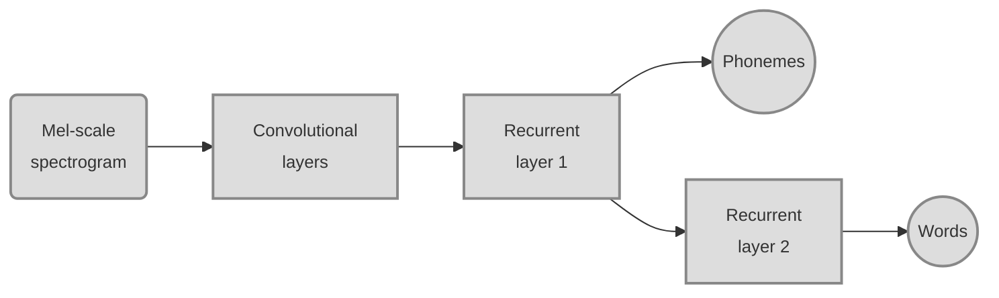
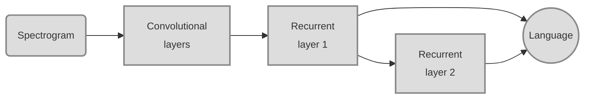

---
authors:
- admin
categories:
- Demo
date: "2020-04-01T00:00:00Z"
draft: true
featured: false
_build:
  render: true
  list: never
  publishResources: true
image:
  caption: 'Image credit: [**Unsplash**](https://unsplash.com/photos/CpkOjOcXdUY)'
  focal_point: ""
  placement: 2
  preview_only: true
lastmod: "2020-04-01T00:00:00Z"
projects: []
subtitle: ''
summary: Web-demo for the phonetic language model in our recent paper.
tags:
- Academic
title: 'Distinctive language cues'
---
This is work coming out of discussions on bilingualism with my postdoc advisor Denise Klein as well as developmental researchers Krista Byers-Heinlein, Linda Polka and Lena Kremin. A big question in bilingual language learning is how an infant learns to discriminate languages.

[TOC]

[Multilingual neural network training](#sec1)
[Multilingual neural network training](#sec2)
[Multilingual neural network training](#sec3)
[Multilingual neural network training](#sec4)

## Multilingual neural network training 

For training a multilingual speech recognizer I used Mozilla's [Common Voice](https://voice.mozilla.org/en) corpus. This is a large crowd-sourced speech data set containing multiple languages of which I picked German, English and French. The corpus consists of individual sentences recorded by volunteer contributors through a web interface. I aligned transcriptions and audio on the word and phoneme level using the [Montreal Forced Aligner](https://montreal-forced-aligner.readthedocs.io/en/latest/introduction.html) software. The following is an example:

<audio controls="controls">
  <source type="audio/mp3" src="//www.bic.mni.mcgill.ca/~peterd/commonvoice.wav"></source>
  
Your browser does not support the audio element.

</audio>

These are the number of utterances I used for training, development and test splits.

| | German | English | French
-------- | ----- | --- | ---
Train | 252261 | 579509 | 137061
Dev | 14255 | 32368 | 7633
Test | 14668 | 32228 | 7668

During training, utterances were sampled from the three languages with uniform probability.

For a given utterance the neural network was fed with a (mel-scale) spectrogram representation of the audio as in the figure above. Based on this it was trained to predict phoneme and word labels for every time point, as shown in the following diagram.

The input goes through a series of convolutional layers (which have fixed receptive fields in time), followed by two recurrent processing layers (which have longer memory: important for language discrimination, see later). Phoneme- and word-level classifications are computed from separate recurrent layers (see Lugosch et al., 2019, *Interspeech*), which forces some hierarchical structure on the networks' processing.

In the following, I show example outputs from the trained network (phoneme classifications) plotted on top of the example spectrogram shown before. You can add/remove traces by clicking on the legend entries.

<iframe width=100% height="430" frameborder="0" scrolling="no" src="//plotly.bic.mni.mcgill.ca/~pdonha/547.embed?share_key=tltX4b3eBVeJMSdvEDrFHD"></iframe>

This is not to show the level of accuracy of the network, I selected automatically a set of phonemes that had a high probability at some point during the utterance. It's rather to demonstrate the dynamic and probabilistic nature of the network's output. The following shows examples of word classifications.

<iframe width=100% height="430" frameborder="0" scrolling="no" src="//plotly.bic.mni.mcgill.ca/~pdonha/622.embed?share_key=wt8LgnTIRVLE1jgwXYJM8d"></iframe>

## Distinct but symmetric speech representations 

<iframe width=100% height="430" frameborder="0" scrolling="no" src="//plotly.bic.mni.mcgill.ca/~pdonha/306.embed?share_key=BrTWh022py14Maag3DhgL8"></iframe>

The plot is busy, but you can remove/add languages by clicking on the figure legend.

<iframe width=100% height="430" frameborder="0" scrolling="no" src="//plotly.bic.mni.mcgill.ca/~pdonha/35.embed?share_key=eHo0sYTW19TP7Iiq36Y6SJ"></iframe>

<iframe width=100% height="430" frameborder="0" scrolling="no" src="//plotly.bic.mni.mcgill.ca/~pdonha/123.embed?share_key=FXiioKjkV2XDozV8g2B3wa"></iframe>

## Language discrimination across time-scales 

To study the language discrimination behavior of the network more explicitly, I replace phoneme & word classifiers with a linear language classifier that receives the concatenated outputs of the two recurrent layers, as shown in the following diagram:

This language 'readout' is trained on the same data while the rest of the network's weights are frozen. The resulting classifier allows us to view language discrimination dynamically as in the following graph:

<!-- <iframe width="720" height="430" frameborder="0" scrolling="no" src="//plotly.bic.mni.mcgill.ca/~pdonha/490.embed?share_key=1trE7mZTrk7ipPti6FdzuW"></iframe> -->

<!--  -->

<!-- <iframe width="720" height="430" frameborder="0" scrolling="no" src="//plotly.bic.mni.mcgill.ca/~pdonha/408.embed?share_key=T40CVRpBdyN1J2vZ79N9RP"></iframe> -->

Here, the classifier's output (language probabilities) is displayed on top of the spectrogram from the example sentence shown earlier. Note that language probabilities do not sum to 1 during pauses, since there is a fourth option "no speech" that the classifier can assign; I left this trace out of the plot to avoid clutter.

After some initial uncertainty, the network correctly classifies the utterance as English from 500 ms onward. The second sentence "the man.." is immediately recognized as English: We can see that this is an effect of context, i.e. memory encoded in the recurrent activity: In the following graph, I show the network's classification when it receives the three parts of the utterance separately (as marked by the vertical lines).

<!-- <iframe width="720" height="430" frameborder="0" scrolling="no" src="//plotly.bic.mni.mcgill.ca/~pdonha/328.embed?share_key=vST8brpuZBeI84rWtWs6dn"></iframe> -->

To evaluate the accuracy of language discrimination, I thus took random snippets of different lengths from utterances of the Common Voice test set. The results of the classification are shown below.

<iframe width=75% height="450" frameborder="0" scrolling="no" src="//plotly.bic.mni.mcgill.ca/~pdonha/400.embed?share_key=IHIVA9GlKzWob9tBVgpICH"></iframe>

We see that discrimination accuracy increases with audio length, plateauing at over 98% for all three language pairs. Accuracy for the pair 'German-English' stays well below the others for audio snippets shorter than one second. As Germanic languages, these two should indeed be more similar to each other than to French as a Romance language. This difference in discrimination accuracy is likely not explainable by the rhythmical differences between the languages (stress- vs. syllable-timed), because rhythmic cues would only be apparent in longer audio snippets: here, we see most divergence at short audio lengths.

<audio controls="controls">
  <source type="audio/mp3" src="//www.bic.mni.mcgill.ca/~peterd/commonvoice_melselect15.wav"></source>
  
Your browser does not support the audio element.

</audio>

<iframe width=75% height="450" frameborder="0" scrolling="no" src="//plotly.bic.mni.mcgill.ca/~pdonha/644.embed?share_key=v5AsqKVInmpq8Ng5Wndf9R
"></iframe>

## Language discrimination cues 

Cues for language discrimination at this short time-scale could be distinctive phonemes or phoneme sequences (phonotactics). In the following graph I show the distinctiveness of each language's phonemes. This was done by letting the network classify one second audio snippets just as shown for the example sentence above. Any distinctive cue for a given language should result in a rise of that language's probability curve: I average the steepness of this curve for each phoneme as a measure of distinctiveness; this is what is plotted in the following graph.

<!--  -->
<iframe width=100% height="430" frameborder="0" scrolling="no" src="//plotly.bic.mni.mcgill.ca/~pdonha/205.embed?share_key=hy3sCKAp2Ki7aYaOVAfuTg"></iframe>

We can appreciate that distinctive phonemes include those that are unique for a given languange, such as German *x*, English *dʒ* or French *ʒ*, but also phonemes that have equivalents in all languages, such as German and French *d*, or French *l*. These might have different phonetic realizations or occur in different contexts between languages.

In the following, I plot distinctiveness of words, defined analogously to phonemes as average steepness of the language probability curve. It's a busy graph, but you can click on it to open a larger, interactive version.

It likely highlights short words that can be easily recognized with little ambiguity between languages, and can thus act as strong language cues.
